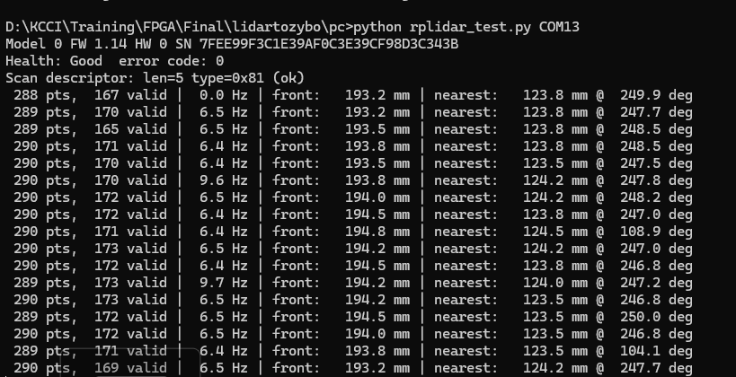
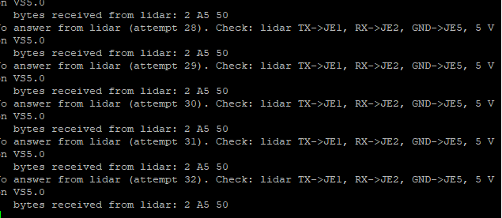
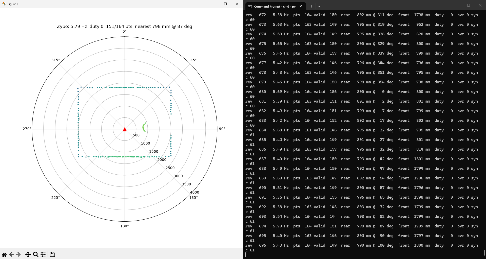
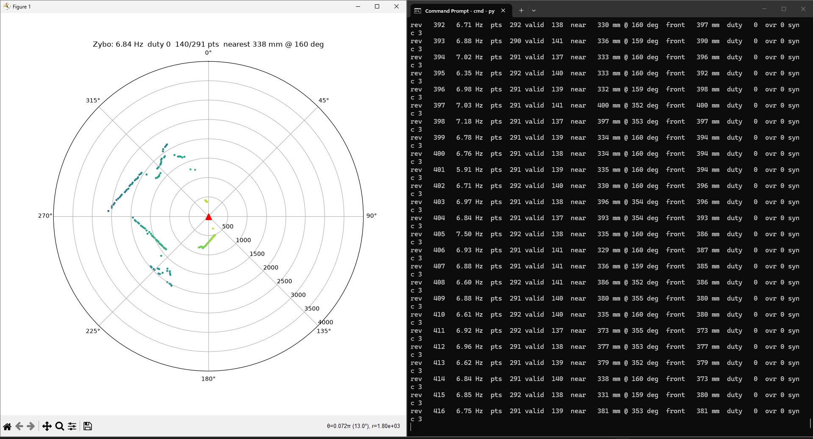

# RPLIDAR A1 → Zybo Z7-10 (bare-metal, AXI UART Lite + PWM in the PL)

Reading 360° scans from a RoboPeak **RPLIDAR A1 (A1M1-R1)** on a Digilent
**Zybo Z7-10**. The lidar's UART and motor control go straight to Pmod JE.
The PL holds an AXI UART Lite, an AXI GPIO and a small Verilog PWM block, and a
bare-metal C program on the Cortex-A9 parses the scan stream and prints one
summary line per revolution. PC tools cover the laptop bench test and a live
polar plot.

## Status

| Part | Status |
|---|---|
| Lidar on the laptop (Stage 1) | ✅ Working on hardware |
| Vivado design (bitstream + `.xsa`) | ✅ Built, timing met (WNS +2.394 ns) |
| `motor_pwm` testbench | ✅ 7/7 duty values pass in xsim |
| Parser (`lidar_parse.c`) | ✅ 11/11 host tests pass |
| Bare-metal app | ✅ Runs on the Zybo; UART Lite verified with a JE1↔JE2 loopback |
| Fake-source pipeline (`FAKE_SRC=1`, `lidar_view.py --bridge`) | ✅ Working on hardware: ~5.4 Hz, 163 pts/rev, 0 overruns, every injected glitch byte resynced |
| Real lidar → laptop → Zybo parser → viewer (`--bridge COMz --source COMx`) | ✅ Working on hardware: ~6.8 Hz, ~290 pts/rev, 0 overruns, 0 resyncs over 400+ revs |
| Lidar ↔ Zybo data link | ⏳ In progress: lidar connector pin mapping being confirmed |

Stage 1 on real hardware (lidar through its USB adapter):



Zybo UART loopback (JE2 wired to JE1; the app receives its own `A5 50` command):



## Bring-up without the lidar wiring: the console bridge

While the lidar connector pinout is unconfirmed, the scan bytes reach the Zybo
through its USB console instead of the PL UART. Build with `#define FAKE_SRC 1`
in `sw/src/main.c`; the Zybo then parses bytes from the console UART and
streams one `F` frame per revolution back to the viewer. Set it to 0 for the
real lidar on the PL UART.

```bat
python pc\lidar_view.py --bridge COM5                  :: software lidar -> Zybo -> plot
python pc\lidar_view.py --bridge COM5 --source COM7    :: real lidar (USB adapter) -> Zybo -> plot
```

| Source | Result |
|---|---|
| Fake room (900 samples/s) | ~5.4 Hz, 163 pts/rev, 0 overruns; every injected glitch byte resynced |
| Real RPLIDAR A1 (~2000 samples/s, the console's limit) | ~6.8 Hz, ~290 pts/rev, 0 overruns, 0 resyncs over 400+ revolutions |

Fake source (4 x 3 m room, box circling) | Real lidar:




## Hardware

- Board: Digilent **Zybo Z7-10** (`xc7z010clg400-1`)
- Sensor: **RPLIDAR A1**, UART 115200 8N1 at 3.3 V logic, 5 V supply

| Lidar | Zybo | FPGA port | Pin |
|---|---|---|---|
| TX | Pmod JE1 | `lidar_uart_rxd` | V12 |
| RX | Pmod JE2 | `lidar_uart_txd` | W16 |
| MOTOCTL | Pmod JE3 | `motoctl` | J15 |
| GND | Pmod JE5 + 5 V supply GND | | |
| VS5.0, VMOTO | external 5 V (not the Pmod, it is 3.3 V only) | | |

Pins checked against the Vivado 2025.1 `zybo-z7-10` board file and the
post-placement IO report. LEDs: LD0 heartbeat per revolution, LD1 scanning,
LD2 object < 1 m in front, LD3 object < 30 cm in front.

## Design

**PL (`hw/build_hw.tcl`, one batch command builds everything)**
- Zynq PS7 with the Zybo preset, FCLK0 = 100 MHz
- AXI UART Lite (115200 8N1) → Pmod JE1/JE2
- AXI GPIO ch1 (8 bit) → [`motor_pwm.v`](hw/motor_pwm.v) (24 kHz, duty 0–255) → MOTOCTL
- AXI GPIO ch2 (4 bit) → LEDs
- Fixed addresses: UART Lite `0x42C00000`, GPIO `0x41200000`

**PS ([`sw/src/main.c`](sw/src/main.c))**
- Uses the low-level `_l.h` register drivers, so it builds under both the
  classic and the SDT (2023.2+) Vitis flows
- **Non-blocking console:** every print goes into a 4 KB RAM ring buffer that
  drains between lidar polls. The UART Lite has only a 16-byte RX FIFO (about
  1.4 ms of lidar data), so a blocking `xil_printf` would overflow it. Overruns
  are counted and printed (`ovr`) as proof.
- Bring-up (GET_INFO → GET_HEALTH, RESET on error → SCAN) with timeouts built
  on one shared deadline, plus a watchdog that restarts the scan after 1.5 s
  without data
- Console keys: `+`/`-` motor duty, `m` motor on/off, `f` frame output, `r` restart

**Parser ([`sw/src/lidar_parse.c`](sw/src/lidar_parse.c))**
The protocol's sync check is only 2 bits (S ≠ S̄, C = 1), so random bytes pass
it about 1 time in 6. The host test showed the plain rule turning 100 kB of
noise into thousands of fake revolutions. The parser therefore also rejects
angles ≥ 360°, needs 3 good nodes in a row before it trusts the alignment, and
drops "revolutions" shorter than 100 points. The same noise now gives 0
revolutions.

## Build and run

```bat
:: 1. hardware (from the Vivado 2025.1 settings64.bat shell)
cd hw
vivado -mode batch -source build_hw.tcl        :: -> lidar_zybo.xsa / .bit
sim_motor_pwm.bat                              :: optional PWM testbench

:: 2. software (from the Vitis 2025.1 settings64.bat shell)
cd ..\sw
vitis -s build_sw.py                           :: -> vitis_ws\lidar_app\build\lidar_app.elf

:: 3. program + run (JP5 on JTAG, serial terminal at 115200 open first)
xsdb run_on_board.tcl
```

PC tools (`pip install -r pc/requirements.txt`):

```bat
python pc\selftest.py                   :: offline tests, no hardware
python pc\rplidar_test.py COM5          :: Stage 1 bench test (or --fake)
python pc\lidar_view.py --lidar COM5    :: live polar plot from the lidar
python pc\lidar_view.py --zybo COM7     :: live plot from the Zybo console
python pc\rplidar_sniff.py COM5         :: raw byte dump for wiring problems
```

Parser host test:

```bat
cd sw\host_test
gcc -std=c99 -Wall -Wextra -I../src test_lidar_parse.c ../src/lidar_parse.c -o test_lidar_parse
test_lidar_parse
```

## Lessons learned

- **The SDT timer doesn't start on its own.** In the Vitis 2025.1 SDT BSP,
  `XTime_GetTime()` just reads the Zynq global timer, and the timer is only
  started inside the first `sleep()`/`usleep()`. A JTAG boot (ps7_init, no
  FSBL) leaves it stopped, so every timeout loop spins forever. The fix is one
  `usleep()` at the top of `main()`.
- **Two talkers on one wire.** Leaving a USB-TTL adapter's TXD in the same
  breadboard row as the lidar's TX meant two outputs fighting on one line, and
  the Zybo received nothing.
- **Test each half on its own.** A JE1↔JE2 loopback proved the FPGA side
  independently of the lidar, and the lidar's own USB adapter proved the
  sensor independently of the Zybo.
- **Windows `cmd`:** `cd D:\...` from `C:` doesn't switch drives. Use `cd /d`.
